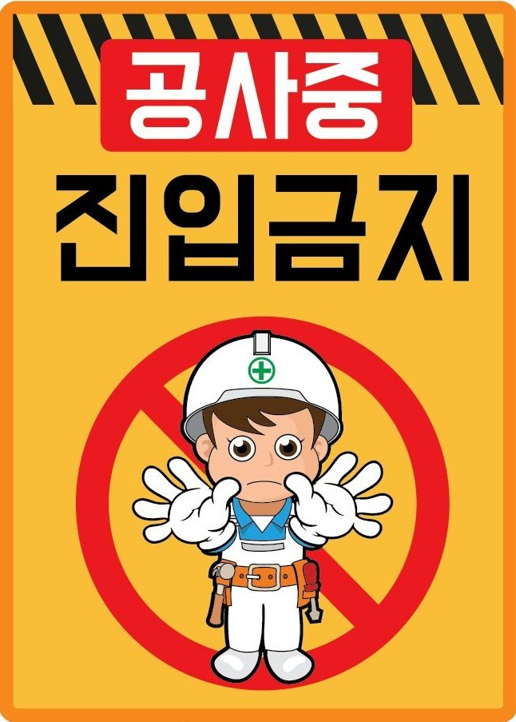

# 문제
|유형|문제 링크|난이도|
|---|---|---|
|[Trail 2 / 함수 / 값을 반환하지 않는 함수](https://www.codetree.ai/trail-info/novice-mid/)|[[Challenge]최대공약수 구하기](https://www.codetree.ai/trails/complete/curated-cards/challenge-find-the-greatest-common-divisor/)|쉬움|
|[Trail 2 / 함수 / 값을 반환하지 않는 함수](https://www.codetree.ai/trail-info/novice-mid/)|[[Challenge]출력결과 20](https://www.codetree.ai/trails/complete/curated-cards/challenge-reading-k201544/)|어려움|
|[Trail 2 / 함수 / 값을 반환하지 않는 함수](https://www.codetree.ai/trail-info/novice-mid/)|[[Challenge]출력결과 72](https://www.codetree.ai/trails/complete/curated-cards/challenge-reading-k201827/)|쉬움|
|[Trail 2 / 함수 / 값을 반환하는 함수](https://www.codetree.ai/trail-info/novice-mid/)|[[Concept]1부터 특정 수까지의 합](https://www.codetree.ai/trails/complete/curated-cards/intro-sum-from-1-to-a-certain-number/)|쉬움|
|[Trail 2 / 함수 / 값을 반환하지 않는 함수](https://www.codetree.ai/trail-info/novice-mid/)|[[Test]최소공배수 구하기](https://www.codetree.ai/trails/complete/curated-cards/test-find-the-least-common-multiple/)|쉬움|

